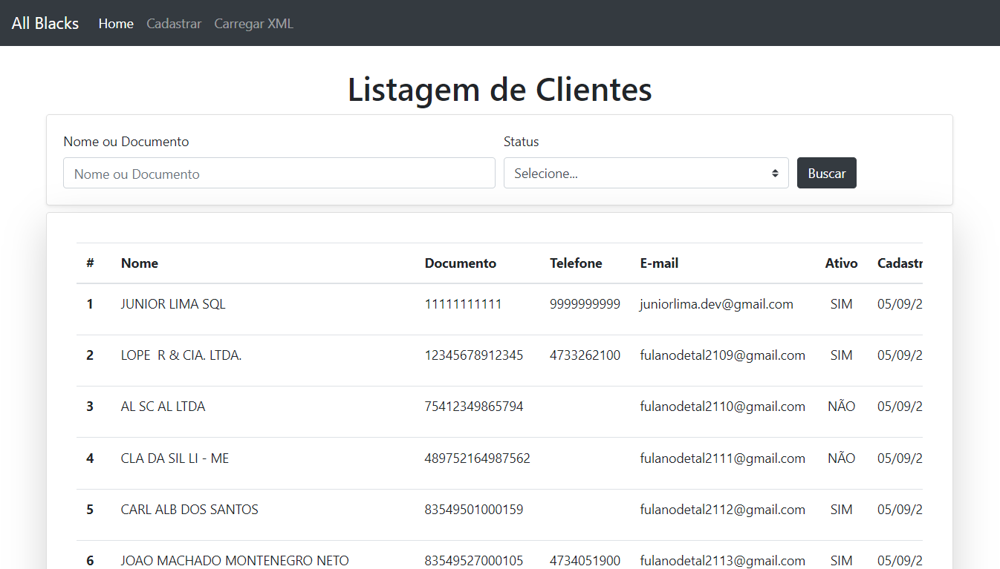

<p align="center" id="top">
    
</p>

<h1 align="center"> Sistema All Blacks com PHP</h1>

<p align="center">
    <a href="#sobre">Sobre</a> • 
    <a href="#features">Features</a> • 
    <a href="#demo">Demo</a> • 
    <a href="#pre-requisitos">Pré-requisitos</a> • 
    <a href="#tecnologias">Tecnologias</a> • 
    <a href="#licenca">Lincença</a> • 
    <a href="#autor">Autor</a> 
</p>

### Sobre

Sistema  All Blacks é uma aplicação web feito com o [PHP](https://www.php.net/). Nessa aplicação foi realizado na prática os principais conceitos de Programação Orientada a Objetos POO e Query Builder. Realizando um CRUD completo com [PDO](https://www.php.net/manual/pt_BR/book.pdo.php) (PHP Data Objects) que é um módulo de PHP montado sob o paradigma Orientado a Objetos, cujo objetivo é prover uma padronização da forma com que PHP se comunica com um banco de dados relacional.

<h3>
    <a href="use_case.md">Caso de uso (Use case)</a>
</h3>

### Caracteristicas principais

- [x] Cadastro de clientes
- [x] Editar clientes
- [x] Deletar clientes
- [x] Validação dos dados por tipos: string, required, int, email, min, max, exits e etc...
- [x] Mensagens de feedback (flash message) ao cadastrar, editar, deletar e etc...
- [x] Listagem de clientes com paginação
- [x] Busca e filtro de clientes
- [x] Importação de arquivo XML com dados de cliente
- [x] Validação de tipo arquivo XML
- [x] Análise do arquivo XML para cadastrar ou atualizar dados dos clientes já existentes

### Demo

<p align="center"><sub>Cadastro de cliente</sub></p>

<p align="center">
    
</p>

<p align="center"><sub>Listagem e busca de cliente</sub></p>

<p align="center">
    
</p>

<p align="center"><sub>Importar arquivo XML de cliente</sub></p>


<p align="center">
    
</p>

<p align="center"><sub>Populando dados dos cliente na base de dados</sub></p>


<p align="center">
    
</p>

<p align="right">
<sub>(Preview)</sub>
</p>

### Pre-requisitos

Antes de começar, você vai precisar ter instalado em sua máquina o [Docker](https://www.docker.com/) ou as seguintes ferramentas: [Git](https://git-scm.com/), [Composer](https://getcomposer.org/), [PHP](https://www.php.net/), [MariaDB](https://mariadb.org/). Além disto é bom ter um editor para trabalhar com o código como [VsCode](https://code.visualstudio.com/)

### 👨🏻‍💻 Rodando o Back End

#### Clone este repositório

```bash
git clone https://github.com/JuniorLima22/all-black.git
```

#### Acesse a pasta do projeto no terminal/cmd

```bash
cd all-blacks
```

### Ambiente Docker <a href="phpdocker/README.html">mais informações</a>

#### Iniciar todos os contêineres em segundo plano

```bash
docker-compose up -d
```

#### Instale o autoload em <code>all-black/public</code>

```bash
composer install
```

Abra seu navegador e acesse o endereço fora dos contêineres <code>localhost</code>: <code>http://localhost:8000</code>

Porta MariaDB: <code>8003</code>

### Ambiente AMP (Apache, MariaDB, PHP) ⮯

#### Instale o autoload em <code>all-black/public</code>

```bash
composer install
```

### 💾 Rodando o Banco de Dados

```bash
# Configure suas variáveis ​​de banco de dados em public/App/Db/Database.php

# Criar um novo esquema no Banco de Dados MariaDB

# Executar o script SQL em database/tabela_clientes.sql para criar a tabela 'Clientes' e popular os dados.
```

Abra seu navegador e acesse o <code>localhost</code>: <code>http://localhost</code>

### Tecnologias

As seguintes ferramentas 🛠 foram usadas na construção do projeto:

<table>
    <tr>
        <td><a href="https://www.php.net/">PHP</a></td>
        <td><a href="https://getcomposer.org/"> Composer</a></td>
        <td><a href="https://mariadb.org/">MariaDB</a></td>
        <td><a href="https://www.google.com/search?q=html5">HTML</a></td>
        <td><a href="https://www.google.com/search?q=css3">CSS</a></td>
        <td><a href="https://git-scm.com/">Git</a></td>
        <td><a href="https://getbootstrap.com/docs/4.0/getting-started/introduction/">Bootstrap</a></td>
        <td><a href="https://www.docker.com/">Docker</a></td>
    </tr>
    <tr>
        <td>7.4.*</td>
        <td>2.0.*</td>
        <td>10.*</td>
        <td>5</td>
        <td>3</td>
        <td>2.*</td>
        <td>4.*</td>
        <td>19.*</td>
    </tr>
</table>

### Licenca

O sistema All Blacks é um software de código aberto licenciado sob a [MIT license](http://opensource.org/licenses/MIT).

### Wakatime
Tempo gasto no IDE para este repositório, rastreado automaticamente com [wakatime](https://wakatime.com/) .

[](https://wakatime.com/badge/github/JuniorLima22/all-black)

### Autor

> Made with 💙 by JUNIOR LIMA 👋 <a href="https://www.linkedin.com/in/JuniorLima22/" target="_blank">See my LinkedIn</a> • GitHub <a href="https://github.com/JuniorLima22" target="_blank">@JuniorLima22</a>

<p align="center">
<sub><a href="#top" align="center">↑ voltar para o topo ↑</a></sub>
</p>